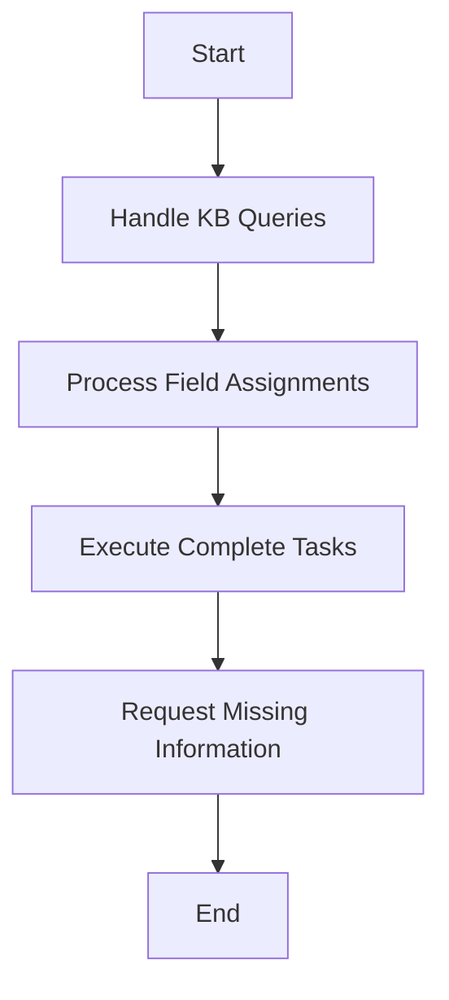

# 🤖 Understanding Agent Policy in Genie Framework

!!! tip "Quick Summary"
    Agent Policy is the brain 🧠 of the Genie framework that makes smart decisions about how to respond to users. Think of it as a very organized manager that always knows what to do next!

## 🎯 What is Agent Policy?

Agent Policy is a core component of the Genie framework that determines how the conversational agent should respond to user inputs. Unlike traditional LLM approaches that rely on the model to directly generate responses, Genie uses a symbolic module to compute agent responses in a more controlled and reliable way.

!!! note "Key Difference"
    Traditional LLMs: "Let me generate whatever feels right" 🎲
    
    Genie Agent Policy: "Let me follow these specific rules step by step" ✅

## 🤔 Why Use a Symbolic Agent Policy?

There are two main reasons:

1. **Deterministic Responses** 🎯
    - By providing specific agent acts, the LLM generates responses that are governed by the policy
    - No more random or unpredictable responses!

2. **Better Instruction Following** 📝
    - LLMs often struggle with following complex developer-defined policies
    - A symbolic module helps ensure all instructions are properly followed

## ⚙️ How Agent Policy Works

!!! abstract "Input/Output Flow"
    **Inputs** 📥
    - Previous dialogue state
    - Updated dialogue state from the parser
    - Worksheet specification

    **Outputs** 📤
    - New dialogue state
    - Set of agent acts to be performed

### 🔄 Core Steps of Agent Policy



1. **Handle Knowledge Base (KB) Queries** 🔍
    ```python
    if new_kb_record:
        if missing_required_parameters:
            ask_user()
        else:
            execute_query()
            report_results()
    ```

2. **Process Field Assignments** ✍️
    ```python
    for field in new_assignments:
        if needs_confirmation:
            ask_user_to_confirm()
        else:
            execute_actions()
            update_state()
    ```

3. **Execute Complete Tasks** ✅
    ```python
    for task in complete_tasks:
        if not executed:
            execute_worksheet_actions()
            update_state()
            add_agent_acts()
    ```

4. **Request Missing Information** ❓
    ```python
    for field in required_fields:
        if is_empty(field):
            ask_user(field)
            break
    ```

## 🎭 Types of Agent Acts

!!! info "The Five Core Acts"
    1. **Report** 📊 
        ```python
        Report(query, answer)
        ```
        - Reports query results to user
        - Example: "Here are the restaurants I found..."
        - Used for sharing KB query results

    2. **Confirm** ✔️ 
        ```python
        AskForFieldConfirmation(worksheet, field, value)
        ```
        - Verifies field values with user
        - Example: "Just to confirm, you want to book for 7 PM?"
        - Ensures data accuracy

    3. **Say** 💬 
        ```python
        Say(utterance)
        ```
        - Delivers direct messages
        - Example: "I'll help you book a restaurant."
        - Used for general communication

    4. **Propose** 💡 
        ```python
        ProposeWorksheet(worksheet, parameters)
        ```
        - Suggests new tasks/actions
        - Example: "Would you like to make a reservation?"
        - Includes initial parameter values

    5. **Ask** ❓ 
        ```python
        AskField(worksheet, field, field_description)
        ```
        - Requests specific information
        - Example: "What date would you like to book for?"
        - Includes field description

### 🎯 Agent Acts in Action

!!! example "Restaurant Booking Example"
    ```python
    # Initial Search
    [
        Report(
            query="looking for restaurants in SF",
            answer=["Nice Place", "Good Food"]
        )
    ]

    # Proposing Booking
    [
        ProposeWorksheet(
            worksheet="BookRestaurant",
            parameters={"restaurant": "Nice Place"}
        )
    ]

    # Gathering Details
    [
        AskField(
            worksheet="booking",
            field="date",
            description="Preferred booking date"
        )
    ]

    # Confirming Details
    [
        AskForFieldConfirmation(
            worksheet="booking",
            field="time",
            value="19:00"
        )
    ]
    ```

### 🔄 Common Act Sequences

!!! tip "Typical Flows"
    1. **Search & Book Flow** 📝
        ```python
        # 1. Report search results
        Report(query, results)
        # 2. Propose booking
        ProposeWorksheet("BookRestaurant", {...})
        # 3. Ask for details
        AskField("booking", "date")
        # 4. Confirm final details
        AskForFieldConfirmation("booking", "all")
        ```

    2. **Information Query Flow** 🔍
        ```python
        # 1. Report answer
        Report(query, answer)
        # 2. Ask if more info needed
        Say("Would you like to know anything else?")
        ```

    3. **Modification Flow** ✏️
        ```python
        # 1. Confirm current value
        AskForFieldConfirmation(worksheet, field)
        # 2. Ask for new value
        AskField(worksheet, field)
        # 3. Confirm change
        Report("update_status", result)
        ```

### ⚙️ Act Parameters

!!! abstract "Parameter Details"
    1. **Worksheet** 📋
        - The form/task being handled
        - Examples: BookRestaurant, CourseEnroll
        - Must be a valid worksheet type

    2. **Field** 🏷️
        - Specific data point needed
        - Examples: date, time, guests
        - Must exist in worksheet

    3. **Description** 📝
        - User-friendly field explanation
        - Helps generate clear questions
        - Should be descriptive

    4. **Value** 💡
        - Current or proposed value
        - Used in confirmations
        - Must match field type

### 🎨 Response Generation

!!! info "Response Guidelines"
    1. **Formatting** 📝
        - Be polite and friendly
        - Use conversation context
        - Keep responses natural

    2. **Priority** ⚡
        ```python
        if agent_acts:
            # Always perform listed actions first
            execute_acts_in_order()
        else:
            # Then handle direct responses
            respond_to_user()
        ```

    3. **Context** 🔄
        - Reference previous states
        - Maintain conversation flow
        - Use appropriate formality

---

!!! quote "Remember"
    Agent acts are the building blocks of conversation - they help create structured, reliable, and natural interactions! 🌟

## 🎬 Example Flow

!!! example "Restaurant Booking Scenario"
    ```
    User: "I want to book a romantic restaurant in London" 🍽️

    Agent Policy Process:
    1. 🔍 Creates KB record to search restaurants
    2. ✨ Checks required parameters (date, time needed)
    3. ❓ Asks user: "What date would you like to book for?"
    4. ⏰ After getting date, asks for time
    5. 🎉 Once all parameters are present:
       - Executes restaurant search
       - Reports matching restaurants
       - Proposes booking task with found restaurant
    ```

## 🌟 Benefits of Genie's Agent Policy

!!! success "Key Advantages"
    1. **Reliable Context Management** 🧠
        - Never forgets important conversation details
    2. **Controlled Flow** 🎮
        - Ensures all required information is collected
    3. **Predictable Behavior** 🎯
        - Follows developer-defined rules consistently
    4. **Mixed Initiative Handling** 🤝
        - Handles both user and system initiatives effectively

## 📊 Performance Impact

!!! tip "Real User Study Results"
    Genie's agent policy achieved impressive results:

    | Metric | Score | vs GPT-4 |
    |--------|--------|----------|
    | Execution Accuracy | 86.5% | +21.1% |
    | Dialog Act Accuracy | 89.2% | +20.1% |
    | Goal Completion Rate | 82.8% | +61.0% |

## 🚀 Best Practices

!!! warning "Common Pitfalls to Avoid"
    - Don't skip confirmation steps for critical actions
    - Always handle missing required fields
    - Keep track of conversation state
    - Handle user interruptions gracefully

## 🔍 Debugging Tips

!!! tip "Troubleshooting Guide"
    1. Check dialogue state consistency
    2. Verify all required fields are being tracked
    3. Monitor agent act sequences
    4. Review KB query results
    5. Validate field assignments

## 🎓 Learning Resources

!!! info "Further Reading"
    - [Genie Framework Documentation](https://github.com/stanford-oval/genie-worksheets)
    - [Research Paper](https://arxiv.org/html/2407.05674v2)
    - [Example Implementations](https://github.com/stanford-oval/genie-worksheets/examples)

---

!!! quote "Remember"
    The power of Genie's Agent Policy lies in its ability to maintain structure while being flexible enough to handle natural conversations! 🌟 