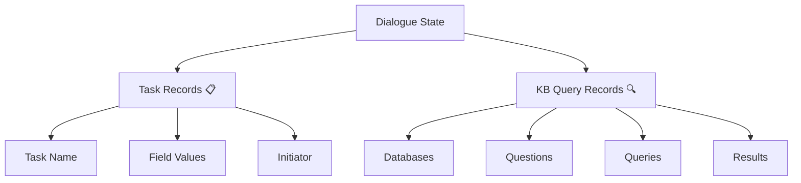

# 🧠 Understanding Dialogue State in Genie

!!! tip "Quick Summary"
    Dialogue state is like the agent's memory bank 🧠 - it's how Genie remembers everything important about your conversation without getting overwhelmed! Think of it as a super-organized note-taker that never misses a detail.

## 🤔 What is Dialogue State?

Dialogue state is how a conversational agent keeps track of what's happening in a conversation. Think of it like the agent's memory - it needs to remember what you've said, what it has said, and what tasks are in progress.

## 📝 The Challenge with Traditional Methods

!!! warning "Common Problems"
    Traditional methods of managing dialogue state face two big challenges:

    1. **Full History Method** 📚
        - Like trying to remember every word of a long conversation
        - Gets overwhelming quickly
        - Important details get lost in the noise

    2. **Summarization Method** 📋
        - Like taking quick notes during a meeting
        - Often misses crucial details
        - Can't recover lost information

## ⚡ How Genie Manages Dialogue State

!!! success "Genie's Smart Approach"
    Instead of trying to remember everything or creating summaries, Genie uses a structured approach called "formal dialogue state" - like having a perfect personal assistant taking organized notes! 

### 🏗️ Components of Genie's Dialogue State



Each dialogue state has two types of records:

1. **Task Records** 📋
    - Name of the task (e.g., "booking a restaurant" 🍽️)
    - Values filled in (e.g., people count, date, time ⏰)
    - Who started the task (user or agent 🤖)

2. **KB Query Records** 🔍
    - The databases being queried 💾
    - The natural language question ❓
    - The formal query 🔎
    - The results ✨

### 🎯 Example of Dialogue State

!!! example "Course Enrollment Scenario"
    ```python
    # First Turn: User asks about a course
    KB_Query_Record = {
        "question": "What courses are available for logic?",
        "result": "CS 103 is available"
    }

    # Second Turn: User decides to enroll
    Task_Record = {
        "task": "Course Enrollment",
        "fields": {
            "course_name": "CS 103",
            "grade_type": "Letter",
            "units": 4
        }
    }
    ```

## 🔄 How Genie Uses Dialogue State

!!! abstract "Processing Steps"
    1. **Understanding** 🎯
        - Semantic parser interprets user input
        - Considers current dialogue state context

    2. **Execution** ⚡
        - Performs necessary database queries
        - Executes requested actions

    3. **Decision Making** 🤔
        - Agent policy decides next steps
        - Plans what information to request

    4. **Response Generation** 💬
        - Creates natural, contextual responses
        - Based on current state and plans

## 🌟 Benefits of Genie's Approach

!!! success "Key Advantages"
    1. **Better Memory** 🧠
        - Organized, structured information
        - No important details lost

    2. **Accurate Responses** 🎯
        - No made-up information
        - No redundant questions

    3. **Flexible Conversations** 🔄
        - Switch between tasks easily
        - Handle multiple topics at once

    4. **Developer Control** 🛠️
        - Easy to program behavior
        - Clear state management

## 🎬 Real-World Examples

### 1. Restaurant Booking 🍽️

!!! example "Restaurant Flow"
    ```python
    # User: "I want a family friendly restaurant in SF"
    state = {
        "kb_query": {
            "type": "restaurant_search",
            "filters": {
                "location": "San Francisco",
                "features": ["family friendly"]
            }
        },
        "task": {
            "type": "booking",
            "status": "searching"
        }
    }
    ```

### 2. Course Enrollment 📚

!!! example "Course Flow"
    ```python
    # User: "What's the rating for CS 221?"
    state = {
        "kb_query": {
            "course": "CS 221",
            "query_type": "ratings",
            "result": "4.16 average"
        },
        "task": {
            "type": "enrollment",
            "status": "info_gathering"
        }
    }
    ```

## 🔍 Debugging Tips

!!! tip "State Debugging Guide"
    1. Check state consistency after each turn
    2. Verify field updates are being tracked
    3. Monitor KB query results
    4. Validate task transitions
    5. Review state history for context

## 🎓 Best Practices

!!! info "State Management Tips"
    - Keep states clean and organized
    - Update fields promptly
    - Maintain clear relationships
    - Document state transitions
    - Handle edge cases gracefully

## 🎭 Prompt Representation

!!! info "Dialogue State in Prompts"
    The dialogue state is carefully represented in prompts to help models understand and process conversations effectively.

### 🔄 State Format in Prompts

````python
# Basic State Structure
State:
```
user_info = UserInfo(user_task='Book Restaurant')
answer = answer("looking for a nice restaurant in SF")
restaurant = [Restaurant(
    name="Nice Place",
    location="San Francisco",
    rating=4.5
)]
book_restaurant = BookRestaurant(
    restaurant=restaurant[0],
    date="2024-04-22"
)
```
````

### 📝 Key Components in Prompts

!!! example "Prompt Components"
    1. **State Declaration** 🏷️
        ```python
        State:
        ```
        - Clearly marks the beginning of state information
        - Helps models identify state context

    2. **Variable Assignments** 📌
        ```python
        user_info = UserInfo(...)
        answer = answer(...)
        ```
        - Direct assignments for state tracking
        - Clear variable naming conventions

    3. **Nested Objects** 🎯
        ```python
        restaurant = [Restaurant(
            name="...",
            location="...",
            rating=...
        )]
        ```
        - Structured data representation
        - Easy to parse and update

### 🛠️ Prompt Guidelines

!!! tip "Best Practices"
    1. **State Updates** 🔄
        ```python
        # Updating existing state
        book_restaurant.time = "19:00"
        
        # Creating new state
        new_restaurant = Restaurant(...)
        ```

    2. **Query Handling** 🔍
        ```python
        # Knowledge queries
        answer = answer("what are the ratings?")
        
        # State queries
        current_booking = book_restaurant.details
        ```

    3. **Confirmation States** ✅
        ```python
        # Confirmation handling
        book_restaurant.confirm = True
        book_restaurant.special_requests = "window seat"
        ```

### 🎯 Example Prompt Flows

!!! example "Restaurant Booking Flow"
    ```python
    # Initial Query
    State:
    answer = answer("find Italian restaurants")
    
    # After Restaurant Selection
    State:
    restaurant = [Restaurant(...)]
    book_restaurant = BookRestaurant(
        restaurant=restaurant[0]
    )
    
    # After Details Added
    State:
    book_restaurant.time = "19:00"
    book_restaurant.date = "2024-04-22"
    book_restaurant.guests = 4
    ```

### 🔗 Integration with Agent Actions

!!! abstract "Action Integration"
    ```python
    # State with Agent Actions
    State:
    book_restaurant = BookRestaurant(...)
    
    Agent Action:
    [
        "AskField(book_restaurant, time)",
        "ConfirmBooking(book_restaurant)"
    ]
    ```

---

!!! quote "Remember"
    The prompt representation of dialogue state is the bridge between natural language and structured data - making it clear, consistent, and easy to process! 🌟
