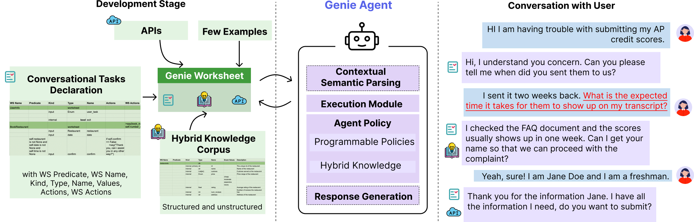

# Home

## What is Genie Worksheets?

> TLDR: Framework for creating reliable conversational agents

Genie is a programmable framework for creating task-oriented conversational agents that are designed to handle complex user interactions and knowledge access.
Unlike LLMs, Genie provides reliable grounded responses, with controllable agent policies through its expressive specification, Genie Worksheet.
In contrast to dialog trees, it is resilient to diverse user queries, helpful with knowledge sources, and offers ease of programming policies through its declarative paradigm.




!!! tip "When to use Genie Worksheets?"
    GenieWorksheets excels at handling complex dialogues where the agent actively provides assistance to the user.
You should use GenieWorksheets if you need:

    - Task-oriented agents integrated with knowledge - GenieWorksheets uniquely combines both capabilities.
    
    - Mixed-initiative conversations where users can interrupt and switch between tasks seamlessly.
    
    - Precise control over agent responses and behaviors through explicit programming controls.

##  :rocket: Features

- **High-Level Declarative Specification:** Allows developers to easily define variables and actions for conversations through a spreadsheet-like format, without needing to manually code complex dialogue trees or manage LLM prompts.

- **Integrated Knowledge and Task Handling:** Uniquely combines the ability to handle both structured database queries and API calls in a single conversation flow, letting users seamlessly mix questions with task completion.

- **Reliable State Tracking:** Maintains conversation context through a formal dialogue state representation, reducing hallucinations and repetitive questioning common in pure LLM approaches.

- **Programmable Agent Policies:** Provides fine-grained control over agent behavior through explicit policy definitions, while still maintaining natural conversation flow and handling unexpected user inputs.

## :zap: Getting Started

- Install the package ([see installation for detailed instructions](installation.md))
- Define your agent in a python file
- Run your agent using the GenieWorksheets command-line interface or through a web interface

## :vs: Comparative Analysis

| Feature | GenieWorksheets | Pure LLMs | Dialog Trees |
|---------|----------------|------------|--------------|
| Handles unexpected queries | :white_check_mark: | :white_check_mark: | :x: |
| Consistent output | :white_check_mark: | :x: | :white_check_mark: |
| Knowledge integration | :white_check_mark: | :white_check_mark: | :x: |
| Easy maintenance | :white_check_mark: | :x: | :x: |
| Natural conversations | :white_check_mark: | :white_check_mark: | :x: |
| Control over responses | :white_check_mark: | :x: | :white_check_mark: |
| Complex logic support | :white_check_mark: | :x: | :x: |
| Low hallucination risk | :white_check_mark: | :x: | :white_check_mark: |
| Handles interruptions | :white_check_mark: | :white_check_mark: | :x: |
| Programmable behaviors | :white_check_mark: | :x: | :white_check_mark: |
| Dynamic field dependencies | :white_check_mark: | :x: | :x: |
| Development speed | :white_check_mark: | :white_check_mark: | :x: |


## :books: Research Paper

GenieWorksheets was introduced in our paper ["Coding Reliable LLM-based Integrated Task and Knowledge Agents with GenieWorksheets"](https://arxiv.org/abs/2407.05674). The paper details the design principles, implementation, and evaluation of the framework.

### Citation

If you use GenieWorksheets in your research, please cite our paper:

```bibtex
@article{genieworksheets,
  title={Coding Reliable LLM-based Integrated Task and Knowledge Agents with GenieWorksheets},
  author={Joshi, Harshit and Liu, Shicheng and Chen, James and Weigle, Robert and Lam, Monica S},
  journal={arXiv preprint arXiv:2407.05674},
  year={2024}
}
```